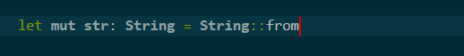
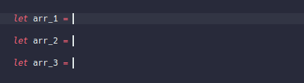
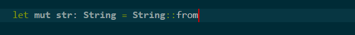

# Leaper

Leaper provides the ability to leap out of autoclosing pairs with `Tab`!

## Leaper In Action

## How It Works

The user's input is monitored for the insertion of any autoclosing pairs. By default, these pairs (called the trigger pairs) are monitored globally:

    (), {}, [], '', "", ``

but the user can change them via the contribution [`leaper.languageRules`](#`leaper.languageRules`).

When the insertion of any of the trigger pairs are detected, the extension will begin to track its position in the document and provide the user the ability to leap out of it.

## Extension Keybindings

### `Tab` - Leap

Move the cursor to just past the closing character of the nearest available pair, **provided there is line of sight to the closing character of the pair**. If there is non-whitespace text between the cursor and the closing character then there is no line of sight.

If there are multiple nested pairs, a single leap command will only jump out of the nearest one.

This keybinding is lower in priority than accepting suggestions and overwriting active text selection, but is higher priority than jumping to next tabstop.

### `Shift` + `Escape` - Escape Leaper Mode

Clear the list of pairs that are being tracked by the extension.

This keybinding is higher in priority than closing hover tooltips (like suggestion and parameter hints), cancelling text selection and leaving snippet mode.

## Extension Contributions

### `leaper.customDecorationOptions`

The decoration of the closing character can also be customized.

For instance, to have a black outline appear around the closing character of a pair, the contribution can be set to:

    "leaper.customDecorationOptions": {
        "outlineColor": "black",
        "outlineWidth": "1px",
        "outlineStyle": "solid"
    }

For the entire list of available properties, please see [Visual Studio Code - vscode namespace API - DecorationRenderOption](https://code.visualstudio.com/docs/extensionAPI/vscode-api#DecorationRenderOptions).

To turn off the decoration, just set it to an empty brace:

    "leaper.customDecorationOptions": {}

### `leaper.decorateOnlyNearestPair`

The default behavior of Leaper is to decorate only the nearest pair that is being tracked. 

To decorate all the pairs that are being tracked, set this contribution to `true`. When enabled:

### `leaper.languageRules`

Users can use this contribution to set the pairs that will trigger the extension. The default value for this contribution (which should cover most uses cases) is:

    "leaper.languageRules": {
        "*": ["()", "[]", "{}", "''", "\"\"", "``"]
    },

`"*"` is the global rule that applies to all languages that don't have their own rules. We may modify it, or we may set rules for specific languages. For instance, we can apply a smaller set of rules for Typescript and turn off pair detection for C++ like so:

    "leaper.languageRules": {
        "*": ["()", "[]", "{}", "''", "\"\"", "``"]
        "typescript": ["()", "[]", "{}"],
        "cpp": [],
    }

The key of each entry needs to be a language ID. The language ID of a language can be found in the editor's `Change Language Mode` menu accessible via the command pallete.

Notes:
1. Leaving out the global language rule (`"*"`) does not disable it. If you wish to disable it you need to set its value to an empty array (`[]`).
2. There currently is no support for pairs that have more than one character on each side.

## Feedback and Help

Your feedback and help are very much encouraged! Please visit the [GitHub repository](https://github.com/OnlyLys/Leaper) to contribute.