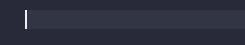

# Leaper

This extension provides the ability to leap out of autoclosing pairs with `Tab`.

## How It Works

Whenever you insert any of the following autoclosing pairs:

    (), {}, [], <>, '', "", ``

this extension will begin to track its position in the document and provide you
the ability to leap (i.e. jump) out of it with a `Tab` keypress. Pairs that are
being tracked will have their closing sides decorated, and the decorations can 
be customized with the `leaper.decorateAll` and `leaper.decorationOptions` 
configurations.

Once you have leaped out of a pair, or have intentionally moved the cursor out 
of a pair, then that pair will no longer be tracked by this extension.

You can customize which autoclosing pairs are tracked by this extension with the 
`leaper.detectedPairs` configuration.

## Commands

### `leaper.leap` (Keybinding: `Tab`)
    
This command moves the cursor out of the nearest available pair.

By 'available' we mean:

 1. The pair must be a pair that is being tracked by this extension.
 2. There is either no text or only whitespace text between the cursor and the 
    closing side of said pair.

This command works when there are multiple cursors as well. 

#### _Potential Conflict with Tab Completion Feature_

`leaper.leap`'s default `Tab` keybinding, while suitable for most use cases, can 
conflict with vscode's [tab completion] feature, since that feature requires 
users to press the `Tab` key, possibly at places where there are pairs that can 
be leaped out of. 

However, since vscode's tab completion feature is disabled by default, most users 
should not experience any such keybinding conflicts.

**Note that tab completion is not the same as quick suggestion, which is the 
default vscode suggestion mode.**

[tab completion]: https://code.visualstudio.com/docs/editor/intellisense#_tab-completion

### `leaper.escapeLeaperMode` (Keybinding: `Shift` + `Escape`)

This command clears the list of pairs that are being tracked.

## Configurations

### `leaper.decorateAll`

This configuration specifies whether decorations are applied to all pairs that 
are being tracked or just the ones nearest to each cursor.

Here is what it looks like disabled:

and here is what it looks like enabled: 

This configuration is disabled by default.

### `leaper.decorationOptions`

This configuration specifies the style of the decorations.

This configuration accepts a subset of vscode's [DecorationRenderOptions]. Most 
of the properties in that type are supported. For properties relating to color, 
you can specify a either a hex RGB(A) value string or a [theme color identifier] 
string. Theme color identifers allow you to reference a color in the current theme 
you are using. If a color string begins with a `#`, it is treated as a hex RGB(A) 
value. Otherwise, it is treated as a theme color identifier.

Suppose you want the following style in light themes:

and the following style in dark themes:

then you can set this configuration to:

    {
        "backgroundColor": "#0000FF9E",
        "outlineColor": "editorBracketMatch.border",
        "outlineStyle": "outset",
        "outlineWidth": "1px",
        "fontWeight": "bolder",
        "light": {
            "backgroundColor": "#0000001A"
        }
    }

The default value of this configuration is:

    {
        "outlineColor": "editorWarning.foreground",
        "outlineStyle": "solid",
        "outlineWidth": "1px",
        "fontWeight": "bolder"
    }

which applies a slight bolding and an outline using the current theme's color 
for warning squiggles.

To disable decorations, set this to `null`.

[DecorationRenderOptions]: https://code.visualstudio.com/api/references/vscode-api#DecorationRenderOptions
[theme color identifier]: https://code.visualstudio.com/api/references/theme-color

### `leaper.detectedPairs`

This configuration specifies which autoclosing pairs this extension should 
detect.

Suppose you want this extension to only detect `()`, `[]` and `{}` pairs. Then
you can set this configuration to:

    [ "()", "[]", "{}" ]

Or suppose you are using a programming language that has `()`, `<>`, `[]`, `||` 
and `$$` as autoclosing pairs. Then if you want this extension to only detect
those pairs, you should set this configuration to:

    [ "()", "<>", "[]", "||", "$$" ]

The default value of this configuration is:

    [ "()", "[]", "{}", "<>", "``", "''", "\"\"" ]
 
which includes the autoclosing pairs of most mainstream programming languages.

## Feedback and Help

Please visit the [GitHub repository](https://github.com/OnlyLys/Leaper).