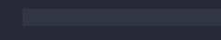

# Leaper

This extension provides the ability to leap out of autoclosing pairs with `Tab`.

## Leaper in Action

## How It Works

The user's input is monitored for the insertion of any autoclosing pairs. 

By default, these are monitored:

    (), {}, [], <>, '', "", ``

When any of the above autoclosing pairs are inserted, this extension will begin 
to track its position in the document and provide the user the ability to leap 
(i.e jump) out of it. 

Once the user has jumped out of a pair, or has intentionally moved the cursor 
out of a pair, then that pair will no longer the tracked by this extension.

## Keybindings

### `Tab` - `leaper.leap` (Leap)

This command causes the cursor to jump out of the nearest available pair.

By 'available' we mean:

 1. The pair must be a pair that is being tracked by this extension.
 2. There is line of sight to the closing side of the pair, meaning there is 
    no non-whitespace text between the cursor and the closing side of the pair.

#### _Potential Conflict with Tab Completion Feature_

`leaper.leap`'s default `Tab` keybinding, while suitable for most use cases, can 
conflict with vscode's [_tab completion_] feature, since that feature requires 
the user to press the `Tab` key, possibly at places where there are pairs that 
can be leaped out of. 

To avoid conflicts, the keybindings of vscode's tab completion feature 
(`insertBestCompletion` and `insertNextSugggestion`) could be rebound to another 
key. Alternatively, `leaper.leap` could be rebound as well to avoid the conflict. 

**Note that tab completion is not the same as quick suggestion, which is the 
default vscode suggestion mode where a suggestion tooltip appears as the user is 
typing.**

[_tab completion_]: https://code.visualstudio.com/docs/editor/intellisense#_tab-completion

### `Shift` + `Escape` - `leaper.escapeLeaperMode` (Escape Leaper Mode)

This command clears the list of pairs that are being tracked by this extension.

## Configurations

### `leaper.decorationOptions`

Use this configuration to specify the decoration of the closing side of a pair.

Default value: 

    {
        "outlineColor": {
            "id": "editorBracketMatch.border"
        },
        "outlineWidth": "1px",
        "outlineStyle": "solid",
        "fontWeight": "bold"
    }

All of the properties available in vscode's [`DecorationRenderOptions`] (with the
exception of `rangeBehavior`) can be specified. 

However, properties aside from the ones related to `outline`, `border` or `font`
have not been tested, and use of them could cause unwanted side-effects such as 
poor performance.

To turn off decorations, just specify an empty object:

    {}

#### _Custom Types_

Certain properties accept custom types, such as the `outlineColor` property which 
accepts [`ThemeColor`] or the `dark` property which accepts [`ThemableDecorationRenderOptions`].

Because Typescript has [_structural subtyping_], these custom types can be 
specified via a JSON object containing the required properties. For instance, 
see how we were able to supply a `ThemeColor` for the `outlineColor` property in 
the default value of this configuration.

[`DecorationRenderOptions`]: https://code.visualstudio.com/api/references/vscode-api#DecorationRenderOptions
[`ThemeColor`]: https://code.visualstudio.com/api/references/vscode-api#ThemeColor
[`ThemableDecorationRenderOptions`]: https://code.visualstudio.com/api/references/vscode-api#ThemableDecorationRenderOptions
[_structural subtyping_]: https://www.typescriptlang.org/docs/handbook/type-compatibility.html

### `leaper.decorateAll`

Use this configuration to specify whether decorations are applied to all pairs 
that are being tracked or just the ones nearest to each cursor.

Default value:

    false

Here is what it looks like when this configuration is disabled:

And here is what it looks like when it is enabled: 

### `leaper.detectedPairs`

Use this configuration to specify the autoclosing pairs that the extension 
should detect.

Default value:

    [ "()", "[]", "{}", "<>", "``", "''", "\"\"" ]
 
For example, we can disable detection of `""` pairs by specifying:

    [ "()", "[]", "{}", "<>", "``", "''" ]

Or we can enable detection of `||` pairs by specifying: 

    [ "()", "[]", "{}", "<>", "``", "''", "\"\"", "||" ]

Note that there is no support for pairs that are more than 1 character wide on
either side. This means that pairs like `(())` are not allowed.

## Feedback and Help

Please visit the [GitHub repository](https://github.com/OnlyLys/Leaper).